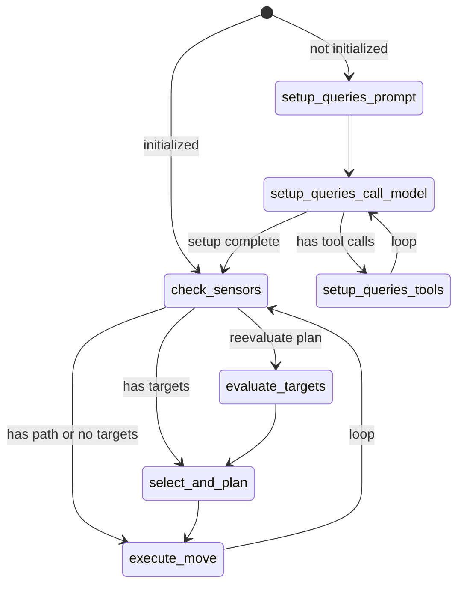

# Terminator Game - langchain-drasi Example

A LangGraph agent that uses **langchain-drasi** to hunt players in real-time using Drasi continuous queries.

This example demonstrates how to build reactive AI agents that respond to real-time database changes through Drasi's continuous query system.

## Overview

This example showcases:
- **Custom LangGraph workflow** that integrates with the Drasi tool
- **SensorHandler** - Custom notification handler for Drasi query results
- **Real-time reactive behavior** - Agent responds immediately to database changes
- **Query discovery and subscription** - Agent uses LLM to discover and subscribe to relevant queries

## Prerequisites

1. **Python 3.11+**
2. **[uv](https://docs.astral.sh/uv/)** - Fast Python package manager
3. **PostgreSQL** database with game schema (see `init_db.sql`)
4. **Drasi MCP server** configured with PostgreSQL source
5. **Azure OpenAI** API access

## Quick Start

```bash
# 1. Install dependencies
cd examples/terminator
uv sync

# 2. Configure environment
cp .env.example .env
# Edit .env with your Drasi server URL, database, and Azure OpenAI credentials

# 3. Initialize database
psql -d game -f init_db.sql

# 4. Configure Drasi resources
drasi apply -f resources/sources.yaml
drasi apply -f resources/queries.yaml

# 5. Run backend (terminal 1)
make backend

# 6. Run terminator agent (terminal 2)
make terminator
```

## How It Works

### langchain-drasi Integration

The terminator agent demonstrates the core langchain-drasi integration pattern:

#### 1. Create a Custom Notification Handler

The `SensorHandler` extends `BaseDrasiNotificationHandler` to receive real-time query results:

```python
from langchain_drasi.callbacks import BaseDrasiNotificationHandler

class SensorHandler(BaseDrasiNotificationHandler):
    def __init__(self, agent_id: str):
        self.agent_id = agent_id
        self.notification_queue = Queue()

    def on_result_added(self, query_name: str, added_data: dict[str, Any]) -> None:
        """Called when Drasi detects a new result in a subscribed query."""
        notification = {
            "type": "added",
            "query": query_name,
            "data": added_data,
            "timestamp": time.time()
        }
        self.notification_queue.put(notification)

    def on_result_updated(self, query_name: str, updated_data: dict[str, Any]) -> None:
        """Called when a result changes."""
        # Handle updates...

    def on_result_deleted(self, query_name: str, deleted_data: dict[str, Any]) -> None:
        """Called when a result is removed."""
        # Handle deletions...
```

#### 2. Configure Drasi Connection

```python
from langchain_drasi import create_drasi_tool, MCPConnectionConfig

# Configure connection to Drasi MCP server
mcp_config = MCPConnectionConfig(
    server_url="http://localhost:8083",
    headers={"Authorization": f"Bearer {token}"} if token else None,
    timeout=30.0,
)

# Create the Drasi tool with your notification handler
drasi_tool = create_drasi_tool(
    mcp_config=mcp_config,
    notification_handlers=[sensor_handler],
)
```

#### 3. Build LangGraph Workflow with Drasi Tool

The agent uses a custom LangGraph workflow that integrates the Drasi tool:

```python
from langgraph.graph import StateGraph
from langgraph.prebuilt import ToolNode

workflow = StateGraph(HuntingState)

# Add nodes
workflow.add_node("setup_queries_call_model", call_model_node)
workflow.add_node("setup_queries_tools", ToolNode([drasi_tool]))
workflow.add_node("check_sensors", check_sensors_node)
# ... more nodes

# Compile and run
hunting_workflow = workflow.compile()
await hunting_workflow.ainvoke(initial_state)
```

### Agent Workflow State Machine

The terminator uses a LangGraph state machine that demonstrates how to integrate Drasi into an agentic workflow:



**Workflow Phases:**

1. **Setup Phase (First Run Only)**
   - **setup_queries_prompt** - Prompts the LLM to discover available Drasi queries
   - **setup_queries_call_model** - LLM calls the drasi_tool with `discover` operation
   - **setup_queries_tools** - Executes the Drasi tool calls to subscribe to relevant queries
   - This phase loops until the LLM has discovered and subscribed to all relevant queries

2. **Main Hunting Loop (Continuous)**
   - **check_sensors** - Checks `SensorHandler` for new Drasi notifications
   - **evaluate_targets** - Uses LLM to parse sensor data and extract target positions
   - **select_and_plan** - Selects closest target and plans path (code-based, no LLM)
   - **execute_move** - Executes the next move via game API
   - Loop continues indefinitely, reacting to new notifications

### Key Integration Points

#### Using the Drasi Tool in the Workflow

The agent uses the drasi_tool during setup to discover and subscribe to queries:

```python
async def call_model_node(state: HuntingState) -> HuntingState:
    """Call LLM with Drasi tool access."""
    response = await llm.bind_tools([drasi_tool]).ainvoke(state["messages"])
    return {"messages": [response]}
```

The LLM receives this prompt:
```
You have access to the drasi_query tool. Use it to:
1. Discover what queries are available (operation="discover")
2. Subscribe to all queries that track player positions (operation="subscribe" with query_name)
```

The LLM then makes tool calls like:
- `drasi_query(operation="discover")` - Returns list of available queries
- `drasi_query(operation="subscribe", query_name="all_players")` - Subscribes to a query

#### Checking Sensors for Notifications

The workflow continuously checks the `SensorHandler` for new notifications:

```python
async def check_sensors(state: HuntingState) -> HuntingState:
    """Check for new Drasi notifications."""
    await asyncio.sleep(0.5)  # Brief wait

    if sensor_handler.has_new_notifications():
        new_notifications = sensor_handler.get_new_notifications()
        # Add to sensor log and trigger re-evaluation
        return {
            "reevaluate_plan": True,
            "sensor_log": [*state["sensor_log"], *new_notifications]
        }

    return state
```

When new notifications arrive, the workflow triggers the `evaluate_targets` node where the LLM parses the sensor data to extract player positions.

### File Structure

```
examples/terminator/
├── agent/
│   ├── terminator.py      # Main TerminatorAgent class with Drasi integration
│   ├── workflow.py        # LangGraph workflow state machine
│   ├── sensor.py          # SensorHandler notification handler
│   └── pathfinding.py     # BFS pathfinding utilities
├── terminator.py          # Entry point
├── backend.py             # Game backend (FastAPI + PostgreSQL)
└── resources/
    ├── sources.yaml       # Drasi PostgreSQL source config
    └── queries.yaml       # Drasi continuous query definitions
```

**Focus on these files for langchain-drasi integration:**
- **`agent/terminator.py`** - Shows how to create and configure the Drasi tool
- **`agent/sensor.py`** - Custom `BaseDrasiNotificationHandler` implementation
- **`agent/workflow.py`** - LangGraph workflow that uses the Drasi tool and checks sensors

## Key Concepts

### Reactive Agent Pattern

This example demonstrates a **reactive agent pattern** where:

1. **Agent subscribes to queries** - Uses LLM + drasi_tool to discover and subscribe
2. **Drasi pushes notifications** - When database changes match query conditions
3. **Agent reacts immediately** - SensorHandler receives notifications, workflow re-evaluates
4. **No polling required** - Agent is notified of changes in real-time

This is more efficient than traditional polling approaches and enables truly reactive AI agents.

### Why Custom Workflow vs create_react_agent?

This example uses a custom LangGraph workflow instead of `create_react_agent` because:

- **More control** - Custom nodes for setup, sensor checking, and execution
- **Stateful behavior** - Maintains path, target, and sensor log across iterations
- **Efficient tool use** - Only calls LLM when needed (setup and target evaluation)
- **Demonstrates LangGraph patterns** - Shows how to build complex agent workflows

## Environment Variables

```env
# Drasi MCP Server
DRASI_SERVER_URL=http://localhost:8083
DRASI_API_TOKEN=your_token_if_required

# Game Backend API
API_BASE_URL=http://localhost:8000

# Azure OpenAI
AZURE_OPENAI_API_KEY=your_api_key
AZURE_OPENAI_ENDPOINT=https://your-endpoint.openai.azure.com/
AZURE_OPENAI_DEPLOYMENT=gpt-4o-mini
AZURE_OPENAI_API_VERSION=2024-02-15-preview

# Database (used by backend)
DB_HOST=localhost
DB_PORT=5432
DB_USER=postgres
DB_PASSWORD=your_password
DB_NAME=game
```

## Troubleshooting

### Agent not receiving notifications
- Verify Drasi MCP server is running and accessible at `DRASI_SERVER_URL`
- Check agent logs for subscription errors during setup phase
- Ensure Drasi queries are correctly configured in `resources/queries.yaml`

### Agent not subscribing to queries
- Check that the LLM has access to the drasi_tool in the workflow
- Verify the setup prompt is being sent to the LLM
- Look for tool call errors in the agent logs

## Learn More

- [LangGraph Documentation](https://langchain-ai.github.io/langgraph/)
- [Drasi Project](https://drasi.io/)
- [langchain-drasi Library](../../README.md)
