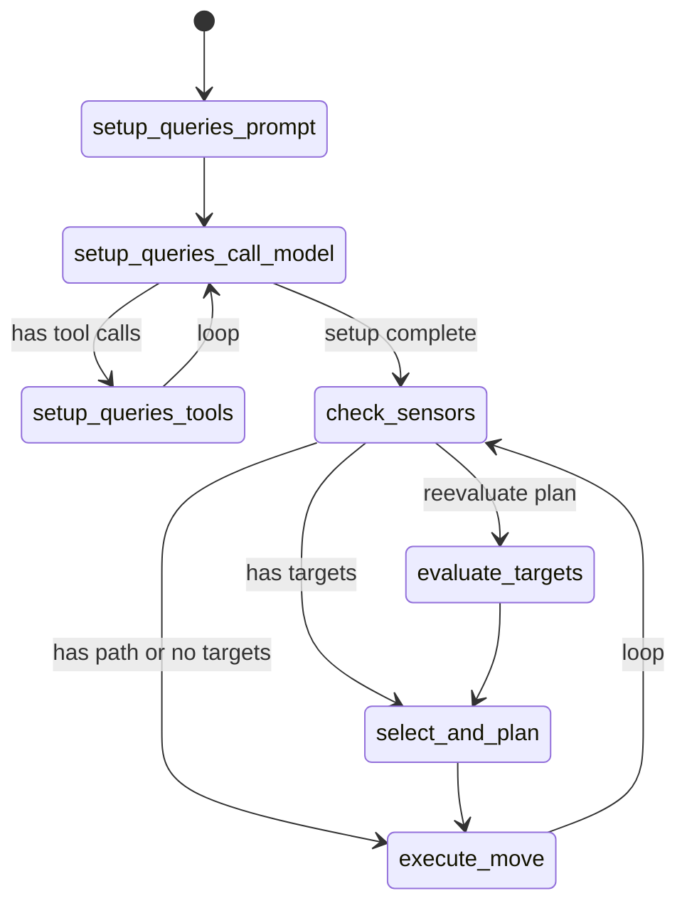

# Terminator Game - langchain-drasi Example

A LangGraph agent that uses **langchain-drasi** to hunt players in real-time using Drasi continuous queries.

This example demonstrates how to build reactive AI agents that respond to real-time database changes through Drasi's continuous query system.

## Overview

This example showcases:
- **Custom LangGraph workflow** that integrates with the Drasi tool
- **BufferHandler** - Built-in notification handler for buffering Drasi query results to be consumed by the workflow
- **ConsoleHandler** - Built-in notification handler for printing updates
- **State reducers** - Automatic trimming of sensor logs to prevent unbounded growth
- **Real-time reactive behavior** - Agent responds immediately to database changes
- **Query discovery and subscription** - Agent uses LLM to discover and subscribe to relevant queries

## Prerequisites

1. **Python 3.11+**
1. **[uv](https://docs.astral.sh/uv/)** - Fast Python package manager
1. **PostgreSQL** database with game schema (see `init_db.sql`), 
    - `wal_level` must be set to `logical` in `postgresql.conf`
1. **Drasi** running in Docker Desktop
1. **Azure OpenAI** API access

## Quick Start

```bash
# 1. Install dependencies
cd examples/terminator
uv sync

# 2. Initialize database
psql -h localhost -p 5432 -U postgres -d game -f init_db.sql

# 3. Configure Drasi resources
drasi apply -f resources/sources.yaml
drasi apply -f resources/queries.yaml
drasi apply -f resources/reaction.yaml

drasi tunnel reaction terminator-mcp 8083

# 4. Configure environment
cp .env.example .env
# Edit .env with your Drasi server URL, database, and Azure OpenAI credentials

# 5. Run backend (terminal 1)
make backend

# 6. Run terminator agent (terminal 2)
make terminator
```

## How It Works

### langchain-drasi Integration

The terminator agent demonstrates the core langchain-drasi integration pattern:

#### 1. Use Built-in Notification Handlers

The agent uses two built-in handlers from `langchain-drasi`:

```python
from langchain_drasi import BufferHandler, ConsoleHandler

# BufferHandler: Queues notifications for sequential processing
buffer_handler = BufferHandler()

# ConsoleHandler: Prints notifications to stdout
console_handler = ConsoleHandler()
```

**BufferHandler** provides:
- `consume()` - Pop and return the next notification
- `is_empty()` - Check if buffer has notifications
- `peek()` - View next notification without consuming
- `size()` - Get current buffer size

Notifications are stored as `NotificationRecord` objects with:
- `query_name` - Name of the Drasi query
- `change_type` - Type of change (added/updated/deleted)
- `data` - The notification data
- `timestamp` - When notification was received

#### 2. Configure Drasi Connection

```python
from langchain_drasi import create_drasi_tool, MCPConnectionConfig

# Configure connection to Drasi MCP server
mcp_config = MCPConnectionConfig(
    server_url="http://localhost:8083",
    headers={"Authorization": f"Bearer {token}"} if token else None,
    timeout=30.0,
)

# Create the Drasi tool with both notification handlers
drasi_tool = create_drasi_tool(
    mcp_config=mcp_config,
    notification_handlers=[buffer_handler, console_handler],
)
```

#### 3. Define State with Reducers

The workflow state uses a reducer to automatically manage sensor log size:

```python
from typing import Annotated
from langgraph.graph import MessagesState

def sensor_log_reducer(existing: list[str], new: list[str]) -> list[str]:
    """Keeps only the most recent 100 sensor logs."""
    combined = existing + new
    return combined[-100:]  # Automatic trimming

class TerminatorState(MessagesState):
    current_position: tuple[int, int]
    path: list[tuple[int, int]]
    current_target: str | None
    reevaluate_plan: bool
    sensor_log: Annotated[list[str], sensor_log_reducer]  # Auto-trimmed
    known_targets: list[dict]
```

The `sensor_log_reducer` ensures the agent doesn't accumulate unbounded history, keeping only the 100 most recent notifications.

#### 4. Build LangGraph Workflow with Drasi Tool

The agent uses a custom LangGraph workflow that integrates the Drasi tool:

```python
from langgraph.graph import StateGraph
from langgraph.prebuilt import ToolNode

workflow = StateGraph(TerminatorState)

# Add nodes
workflow.add_node("setup_queries_call_model", call_model_node)
workflow.add_node("setup_queries_tools", ToolNode([drasi_tool]))
workflow.add_node("check_sensors", check_sensors_node)
# ... more nodes

# Compile and run
hunting_workflow = workflow.compile()
await hunting_workflow.ainvoke(initial_state)
```

### Agent Workflow State Machine

The terminator uses a LangGraph state machine that demonstrates how to integrate Drasi into an agentic workflow:



**Workflow Phases:**

1. **Setup Phase (First Run Only)**
   - **setup_queries_prompt** - Prompts the LLM to discover available Drasi queries
   - **setup_queries_call_model** - LLM calls the drasi_tool with `discover` operation
   - **setup_queries_tools** - Executes the Drasi tool calls to subscribe to relevant queries
   - This phase loops until the LLM has discovered and subscribed to all relevant queries

2. **Main Hunting Loop (Continuous)**
   - **check_sensors** - Checks `BufferHandler` for new Drasi notifications
   - **evaluate_targets** - Uses LLM to parse sensor data and extract target positions
   - **select_and_plan** - Selects closest target and plans path (code-based, no LLM)
   - **execute_move** - Executes the next move via game API
   - Loop continues indefinitely, reacting to new notifications

### Key Integration Points

#### Using the Drasi Tool in the Workflow

The agent uses the drasi_tool during setup to discover and subscribe to queries:

```python
async def call_model_node(state: TerminatorState) -> TerminatorState:
    """Call LLM with Drasi tool access."""
    response = await llm.bind_tools([drasi_tool]).ainvoke(state["messages"])
    return {"messages": [response]}
```

The LLM receives this prompt:
```
You have access to the drasi_query tool. Use it to:
1. Discover what queries are available (operation="discover")
2. Subscribe to all queries that track player positions (operation="subscribe" with query_name)
```

The LLM then makes tool calls like:
- `drasi_query(operation="discover")` - Returns list of available queries
- `drasi_query(operation="subscribe", query_name="all_players")` - Subscribes to a query

#### Checking Buffer for Notifications

The workflow continuously checks the `BufferHandler` for new notifications:

```python
async def check_sensors(state: TerminatorState) -> TerminatorState:
    """Check for new Drasi notifications."""
    await asyncio.sleep(0.5)  # Brief wait

    if not agent.buffer_handler.is_empty():
        # Consume all notifications from buffer
        new_logs = []
        while not agent.buffer_handler.is_empty():
            record = agent.buffer_handler.consume()
            if record:
                notification_dict = {
                    "type": record.change_type,
                    "query": record.query_name,
                    "data": record.data,
                    "timestamp": record.timestamp.timestamp()
                }
                new_logs.append(json.dumps(notification_dict))

        # Return just new logs - reducer handles merging and trimming to 100
        return {
            "reevaluate_plan": True,
            "sensor_log": new_logs
        }

    return state
```

**Key Points:**
- Uses `buffer_handler.is_empty()` to check for notifications
- Calls `buffer_handler.consume()` to pop notifications from the queue
- Converts `NotificationRecord` objects to JSON strings
- Returns only new logs - the `sensor_log_reducer` automatically merges and trims
- When new notifications arrive, triggers the `evaluate_targets` node where the LLM parses sensor data

### File Structure

```
examples/terminator/
├── agent/
│   ├── terminator.py      # Main TerminatorAgent class with Drasi integration
│   ├── workflow.py        # LangGraph workflow state machine with reducers
│   ├── pathfinding.py     # BFS pathfinding utilities
│   └── llm_helpers.py     # LLM prompt building and parsing utilities
├── terminator.py          # Entry point
├── backend.py             # Game backend (FastAPI + PostgreSQL)
├── game_map.py            # Game map utilities
└── resources/
    ├── sources.yaml       # Drasi PostgreSQL source config
    ├── queries.yaml       # Drasi continuous query definitions
    └── reaction.yaml      # Drasi MCP reaction configuration
```

**Focus on these files for langchain-drasi integration:**
- **`agent/terminator.py`** - Shows how to create and configure the Drasi tool with built-in handlers
- **`agent/workflow.py`** - LangGraph workflow that uses BufferHandler, state reducers, and the Drasi tool
- **`backend.py`** - Game backend that generates database changes for Drasi to detect

## Key Concepts

### Reactive Agent Pattern

This example demonstrates a **reactive agent pattern** where:

1. **Agent subscribes to queries** - Uses LLM + drasi_tool to discover and subscribe
2. **Drasi pushes notifications** - When database changes match query conditions
3. **Agent reacts immediately** - BufferHandler queues notifications, workflow consumes and re-evaluates
4. **No polling required** - Agent is notified of changes in real-time
5. **Automatic history management** - State reducer keeps only the 100 most recent notifications

**Key Benefits:**
- **Built-in handlers** - No custom notification handler code needed
- **Sequential processing** - BufferHandler ensures FIFO consumption of notifications
- **Memory safety** - State reducer prevents unbounded history growth
- **Separation of concerns** - BufferHandler manages queue, ConsoleHandler manages logging

This is more efficient than traditional polling approaches and enables truly reactive AI agents.


## Environment Variables

```env
# Drasi MCP Server
DRASI_SERVER_URL=http://localhost:8083
DRASI_API_TOKEN=your_token_if_required

# Game Backend API
API_BASE_URL=http://localhost:8000

# Azure OpenAI
AZURE_OPENAI_API_KEY=your_api_key
AZURE_OPENAI_ENDPOINT=https://your-endpoint.openai.azure.com/
AZURE_OPENAI_DEPLOYMENT=gpt-4o-mini
AZURE_OPENAI_API_VERSION=2024-02-15-preview

# Database (used by backend)
DB_HOST=localhost
DB_PORT=5432
DB_USER=postgres
DB_PASSWORD=your_password
DB_NAME=game
```

## Troubleshooting

### Agent not receiving notifications
- Verify Drasi MCP server is running and accessible at `DRASI_SERVER_URL`
- Check agent logs for subscription errors during setup phase
- Ensure Drasi queries are correctly configured in `resources/queries.yaml`

### Agent not subscribing to queries
- Check that the LLM has access to the drasi_tool in the workflow
- Verify the setup prompt is being sent to the LLM
- Look for tool call errors in the agent logs

## Learn More

- [LangGraph Documentation](https://langchain-ai.github.io/langgraph/)
- [Drasi Project](https://drasi.io/)
- [langchain-drasi Library](../../README.md)
