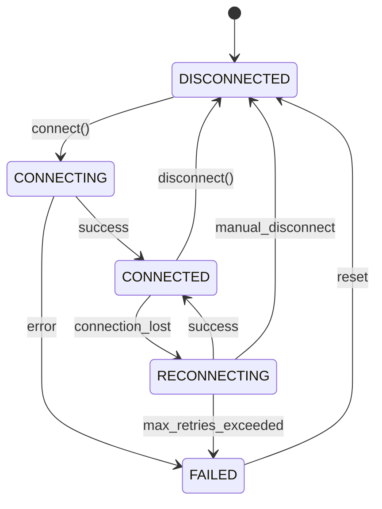
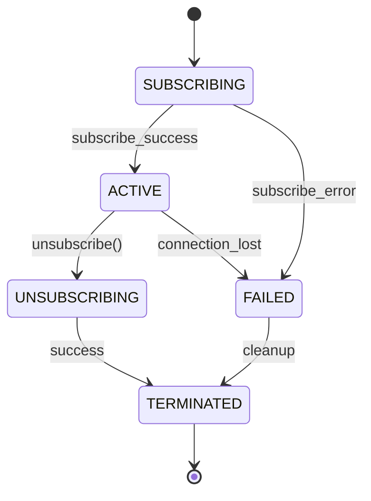
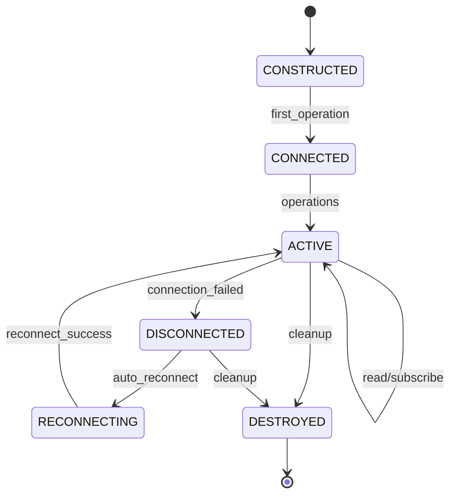

# Data Model: LangChain-Drasi Library

**Feature**: LangChain Extension for Drasi Query Integration
**Created**: 2025-10-01
**Status**: Draft

---

## 1. Overview

This data model defines the core entities and their relationships for the LangChain-Drasi library. The library enables LangChain-based AI agents to discover, read, and subscribe to Drasi queries through an MCP (Model Context Protocol) server. The model supports real-time data access and reactive notifications when query results change.

The data model is designed to:
- Provide a clear abstraction layer between MCP resources and LangChain tools
- Support stateless operation with session-based subscriptions
- Enable callback-driven notification handling
- Maintain compatibility with LangChain's existing patterns

---

## 2. Core Entities

### 2.1 Drasi Query

Represents a named query maintained by the Drasi system and exposed through the MCP server.

#### Attributes
```python
class DrasiQuery:
    name: str                    # Unique identifier for the query
    title: str                   # Display title for the query
    uri: str                     # MCP resource URI in format "drasi://query/{query-name}"
    description: str             # Purpose and nature of the query
    mime_type: str               # Content type, typically "application/json"
```

#### Relationships
- **Has one** Query Result Set (current state)
- **Generates** Change Notifications (when result set changes)
- **Mapped to** MCP Resource (1:1 relationship)
- **Accessed through** Tools (1:many relationship)

#### Validation Rules
- **name** MUST be unique across all queries (FR-005)
- **uri** MUST follow format "drasi://query/{query-name}" (FR-005)
- **description** MUST clearly describe query purpose (FR-006)
- **mime_type** MUST be "application/json"

#### Lifecycle
1. **Discovered**: Query exists on MCP server and can be listed
2. **Accessed**: Query result set is read by an agent
3. **Subscribed**: Active subscription monitors changes
4. **Unsubscribed**: Subscription is terminated

---

### 2.2 Query Result Set

The current set of rows returned by a Drasi query at a point in time.

#### Attributes
```python
class QueryResultSet:
    query_name: str              # Reference to parent Drasi Query
    uri: str                     # Resource URI of the query
    mime_type: str               # Content type
    content: list[dict]          # JSON array of result rows
    timestamp: str | None        # Optional timestamp of result (if provided by MCP)
```

#### Relationships
- **Belongs to** one Drasi Query
- **Triggers** Change Notifications (when modified)
- **Returned by** MCP Resource read operations

#### Validation Rules
- **content** MUST be valid JSON array (FR-002)
- **content** MUST NOT be cached locally (FR-020)
- **query_name** MUST reference an existing Drasi Query

#### State/Lifecycle
- Result sets are **stateless** and fetched on-demand
- No local caching or persistence (FR-020)
- Each read operation returns current state from MCP server

---

### 2.3 Change Notification

Represents a modification to a query result set, delivered by the MCP server.

#### Attributes
```python
class ChangeNotification:
    change_type: ChangeType      # Type of change (added, updated, deleted)
    query_name: str              # Query that changed
    method: str                  # MCP notification method name
    params: dict                 # Change details (the modified data)
    timestamp: str | None        # Optional timestamp of change

class ChangeType(Enum):
    ADDED = "added"              # New row added to result set
    UPDATED = "updated"          # Existing row modified
    DELETED = "deleted"          # Row removed from result set
```

#### Relationships
- **Originates from** one Drasi Query
- **Delivered to** one or more Callback Handlers
- **Triggered by** changes to Query Result Set

#### Validation Rules
- **change_type** MUST be one of: added, updated, deleted (FR-007)
- **method** MUST match format "notifications/{query-name}/{change-type}" (FR-008)
- **params** MUST contain change details as JSON object (FR-009)
- **query_name** MUST reference an existing subscribed query

#### Message Format
Based on MCP specification:
```json
{
  "jsonrpc": "2.0",
  "method": "notifications/{query-name}/{change-type}",
  "params": {
    // Change-specific data fields
  }
}
```

---

### 2.4 MCP Resource

A standardized resource representation following the MCP specification.

#### Attributes
```python
class MCPResource:
    name: str                    # Resource name (matches query name)
    title: str                   # Display title
    uri: str                     # Resource URI
    description: str             # Resource description
    mime_type: str               # Content MIME type

class MCPResourceContent:
    uri: str                     # Resource URI
    mime_type: str               # Content type
    text: str                    # JSON-serialized query result
```

#### Relationships
- **Represents** one Drasi Query (1:1 mapping)
- **Provides** Query Result Set data
- **Supports** subscription operations

#### Validation Rules
- **uri** MUST use "drasi://" scheme (FR-005)
- **mime_type** MUST be "application/json"
- **text** MUST contain valid JSON when present

#### Operations
- **List**: Discover all available resources
- **Read**: Retrieve current result set
- **Subscribe**: Register for change notifications
- **Unsubscribe**: Terminate subscription

---

### 2.5 Tool

LangChain tool abstraction that wraps Drasi query access functionality.

#### Attributes
```python
class DrasiTool:
    name: str                    # Tool identifier
    description: str             # Tool purpose (for LLM consumption)
    mcp_connection: MCPConnection  # Connection to MCP server
    callbacks: list[CallbackHandler]  # Registered notification handlers
    subscriptions: set[str]      # Active query subscriptions (query names)
```

#### Relationships
- **Connects to** one MCP Connection
- **Contains** zero or more Callback Handlers
- **Manages** zero or more Subscriptions
- **Accesses** Drasi Queries through MCP Resources

#### Validation Rules
- **callbacks** MUST be provided during construction (FR-012)
- **mcp_connection** MUST be established before operations (FR-004)
- **subscriptions** MUST be session-based only (FR-021)

#### Operations
- `discover_queries()`: List available Drasi queries
- `read_query(query_name: str)`: Fetch current result set
- `subscribe(query_name: str)`: Register for notifications
- `unsubscribe(query_name: str)`: Cancel subscription

#### Lifecycle
1. **Constructed**: Tool created with callbacks
2. **Connected**: MCP connection established
3. **Active**: Performing reads and managing subscriptions
4. **Disconnected**: Connection lost (handled per FR-017)
5. **Destroyed**: Tool lifecycle ends, subscriptions terminated

---

### 2.6 Callback Handler

User-provided function invoked when change notifications are received.

#### Attributes
```python
class CallbackHandler:
    on_added: Callable[[str, dict], None] | None      # Handler for added notifications
    on_updated: Callable[[str, dict], None] | None    # Handler for updated notifications
    on_deleted: Callable[[str, dict], None] | None    # Handler for deleted notifications
    on_error: Callable[[str, Exception], None] | None # Optional error handler
```

#### Relationships
- **Registered with** one or more Tools
- **Invoked by** Change Notifications
- **Follows** LangChain callback patterns

#### Validation Rules
- At least one notification handler (on_added, on_updated, or on_deleted) SHOULD be provided
- Handlers MUST accept (query_name: str, params: dict) parameters
- Handler exceptions MUST be caught and logged (FR-018)
- Handler failures MUST NOT interrupt notification processing (FR-018)

#### Behavior
- Callbacks follow LangChain's existing callback infrastructure (FR-010)
- Invoked when MCP server emits notifications (FR-011)
- Error handling responsibility lies with the callback implementer (FR-018)

---

### 2.7 MCP Connection

Manages the connection to the MCP server.

#### Attributes
```python
class MCPConnection:
    server_url: str              # MCP server endpoint
    connection_state: ConnectionState  # Current connection status
    reconnect_policy: ReconnectPolicy  # Connection failure handling
    active_subscriptions: dict[str, Subscription]  # Query name to subscription mapping

class ConnectionState(Enum):
    DISCONNECTED = "disconnected"
    CONNECTING = "connecting"
    CONNECTED = "connected"
    RECONNECTING = "reconnecting"
    FAILED = "failed"

class ReconnectPolicy:
    enabled: bool                # Whether to attempt reconnection
    max_retries: int | None      # Maximum retry attempts (None = infinite)
    retry_delay: float           # Delay between retries in seconds
    backoff_multiplier: float    # Exponential backoff multiplier
```

#### Relationships
- **Used by** one or more Tools
- **Manages** Subscriptions
- **Communicates with** MCP Server

#### Validation Rules
- **reconnect_policy** MUST be configurable by user (FR-017)
- Connection MUST be established on first tool invocation if not already connected (FR-008)
- Subscriptions MUST be re-established after reconnection (per Edge Cases)

#### State Transitions
```
DISCONNECTED → CONNECTING → CONNECTED
                    ↓           ↓
                 FAILED ← RECONNECTING
                    ↓           ↑
              DISCONNECTED ←────┘
```

---

### 2.8 Subscription

Represents an active subscription to a Drasi query's change notifications.

#### Attributes
```python
class Subscription:
    query_name: str              # Name of subscribed query
    uri: str                     # Resource URI
    created_at: str              # Subscription timestamp
    state: SubscriptionState     # Current subscription status

class SubscriptionState(Enum):
    SUBSCRIBING = "subscribing"  # Subscription request sent
    ACTIVE = "active"            # Successfully subscribed
    FAILED = "failed"            # Subscription failed
    UNSUBSCRIBING = "unsubscribing"  # Unsubscribe requested
    TERMINATED = "terminated"    # Subscription ended
```

#### Relationships
- **Belongs to** one Drasi Query
- **Managed by** MCP Connection
- **Delivers notifications to** Callback Handlers

#### Validation Rules
- **query_name** MUST reference an existing Drasi Query
- Subscriptions MUST NOT persist across restarts (FR-021)
- Subscriptions MUST be re-created when MCP server reconnects (per Edge Cases)

#### State Transitions
```
SUBSCRIBING → ACTIVE → UNSUBSCRIBING → TERMINATED
     ↓          ↓
   FAILED → TERMINATED
```

---

## 3. Entity Relationship Diagram

```
┌─────────────────┐
│   Drasi Query   │
│                 │
│ - name          │
│ - title         │
│ - uri           │
│ - description   │
│ - mime_type     │
└────────┬────────┘
         │ 1
         │ has
         │
         │ 1
┌────────▼────────────────┐
│   Query Result Set      │
│                         │
│ - query_name            │
│ - uri                   │
│ - content               │
│ - timestamp             │
└─────────────────────────┘
         │
         │ triggers
         │
         ▼ *
┌─────────────────────────┐
│  Change Notification    │
│                         │
│ - change_type           │
│ - query_name            │
│ - method                │
│ - params                │
│ - timestamp             │
└────────┬────────────────┘
         │
         │ delivered to
         │
         ▼ *
┌─────────────────────────┐          ┌──────────────────┐
│   Callback Handler      │          │   Drasi Query    │
│                         │          │                  │
│ - on_added              │          └────────┬─────────┘
│ - on_updated            │                   │ mapped to
│ - on_deleted            │                   │ 1:1
│ - on_error              │          ┌────────▼─────────┐
└────────▲────────────────┘          │  MCP Resource    │
         │                           │                  │
         │ contains                  │ - name           │
         │ *                         │ - title          │
┌────────┴────────────────┐          │ - uri            │
│      Drasi Tool         │          │ - description    │
│                         │◄─────────┤ - mime_type      │
│ - name                  │ accesses │                  │
│ - description           │          └──────────────────┘
│ - mcp_connection        │
│ - callbacks             │
│ - subscriptions         │
└────────┬────────────────┘
         │ uses
         │ 1
         ▼ 1
┌─────────────────────────┐
│    MCP Connection       │
│                         │
│ - server_url            │
│ - connection_state      │
│ - reconnect_policy      │
│ - active_subscriptions  │
└────────┬────────────────┘
         │ manages
         │
         ▼ *
┌─────────────────────────┐
│     Subscription        │
│                         │
│ - query_name            │
│ - uri                   │
│ - created_at            │
│ - state                 │
└─────────────────────────┘
```

---

## 4. State Transitions

### 4.1 MCP Connection States



**State Descriptions:**
- **DISCONNECTED**: No active connection, initial state
- **CONNECTING**: Attempting to establish connection
- **CONNECTED**: Active connection, ready for operations
- **RECONNECTING**: Attempting to restore lost connection (per FR-017)
- **FAILED**: Connection failed and not retrying

**Transitions:**
- `connect()`: Initiated by first tool operation (FR-008)
- `connection_lost`: Handled per user-configured policy (FR-017)
- `max_retries_exceeded`: Based on reconnect policy settings
- `disconnect()`: Explicit connection termination

### 4.2 Subscription States



**State Descriptions:**
- **SUBSCRIBING**: Subscription request sent to MCP server
- **ACTIVE**: Successfully subscribed, receiving notifications
- **FAILED**: Subscription failed (query not found or connection issue)
- **UNSUBSCRIBING**: Unsubscribe request in progress
- **TERMINATED**: Subscription ended (session-based per FR-021)

**Transitions:**
- `subscribe_success`: MCP server confirms subscription
- `subscribe_error`: Query not found or MCP error (per Edge Cases)
- `unsubscribe()`: Explicit unsubscribe request
- `connection_lost`: Handled by reconnection logic (re-establish per Edge Cases)

### 4.3 Tool Lifecycle



**State Descriptions:**
- **CONSTRUCTED**: Tool created with callbacks (FR-012)
- **CONNECTED**: MCP connection established (FR-008)
- **ACTIVE**: Performing operations (reads, subscriptions)
- **DISCONNECTED**: Connection lost temporarily
- **RECONNECTING**: Attempting to restore connection
- **DESTROYED**: Tool cleaned up, resources released

---

## 5. Validation Rules

### 5.1 Query Discovery (FR-001)
- Resources list request MUST return all available Drasi queries
- Each query MUST include name, title, URI, description, and MIME type
- URI MUST follow "drasi://query/{query-name}" format

### 5.2 Query Reading (FR-002, FR-020)
- Read operation MUST always fetch from MCP server (no caching)
- Response MUST contain valid JSON array in text field
- Query name MUST exist in available resources

### 5.3 Subscription Management (FR-003, FR-021)
- Subscribe request MUST reference valid query URI
- Subscriptions MUST be session-based only (no persistence)
- Multiple subscriptions to same query SHOULD be allowed per tool instance

### 5.4 Change Notifications (FR-007, FR-008, FR-009)
- Notification method MUST match pattern: "notifications/{query-name}/{change-type}"
- Change type MUST be one of: added, updated, deleted
- Params field MUST contain JSON object with change details
- Query name in notification MUST match an active subscription

### 5.5 Callback Handling (FR-010, FR-011, FR-012, FR-018)
- Callbacks MUST be provided during tool construction
- Callbacks MUST follow LangChain callback patterns
- Callback exceptions MUST be caught and logged
- Callback failures MUST NOT interrupt notification processing
- System MUST continue after callback errors

### 5.6 Connection Management (FR-017)
- User MUST be able to configure reconnection policy
- Re-established connections MUST recreate subscriptions (per Edge Cases)
- Connection failures MUST be handled per configured policy

### 5.7 Error Handling (FR-018, FR-019)
- Non-existent query access MUST raise error (per Edge Cases)
- MCP server validation errors MUST be propagated
- Callback errors are user responsibility (per Edge Cases)

### 5.8 Data Integrity
- All JSON content MUST be parseable
- Query names MUST be case-sensitive and unique
- URIs MUST be well-formed and follow MCP specification

---

## 6. Integration Points

### 6.1 MCP Server Integration
- **Protocol**: MCP specification 2025-06-18
- **Operations**: resources/list, resources/read, resources/subscribe
- **Notifications**: JSON-RPC 2.0 notification messages
- **Transport**: As defined by MCP implementation

### 6.2 LangChain Integration
- **Tool Interface**: Implements LangChain tool abstraction
- **Callbacks**: Compatible with LangChain callback handlers (FR-010)
- **Agent Integration**: Tools discoverable by LangChain agents

### 6.3 Sample Applications
- **Vanilla LangChain**: Demonstrates basic query access (FR-013)
- **LangGraph**: Shows stateful workflow integration (FR-014)
- **Azure OpenAI**: Uses Azure OpenAI for LLM operations (FR-015, FR-016)

---

## 7. Data Flow Examples

### 7.1 Query Discovery Flow
```
Agent → Tool.discover_queries()
     → MCP Connection → resources/list
     → MCP Server → Response
     → Tool → [Drasi Query list]
     → Agent
```

### 7.2 Query Read Flow
```
Agent → Tool.read_query("active-orders")
     → MCP Connection → resources/read(uri="drasi://query/active-orders")
     → MCP Server → Response(content)
     → Tool → Query Result Set
     → Agent
```

### 7.3 Subscription & Notification Flow
```
Agent → Tool.subscribe("active-orders")
     → MCP Connection → resources/subscribe(uri="drasi://query/active-orders")
     → MCP Server → Subscription confirmed
     → Subscription state = ACTIVE

[Later: Data changes in Drasi]

MCP Server → Notification(method="notifications/active-orders/added", params={...})
          → MCP Connection
          → Tool → Callback Handler.on_added("active-orders", params)
```

---

## 8. Performance & Scalability Considerations

### 8.1 Stateless Design
- No local caching reduces memory footprint (FR-020)
- Each read fetches current data from source
- Suitable for dynamic, frequently-changing data

### 8.2 Subscription Management
- Session-based subscriptions minimize server-side state (FR-021)
- Subscription cleanup on connection loss prevents resource leaks
- Multiple tools can subscribe to same query independently

### 8.3 Callback Performance
- Asynchronous notification handling recommended
- Callback errors isolated to prevent cascading failures (FR-018)
- User responsible for callback implementation efficiency

---

## Appendix: Type Definitions

### Python Type Hints (Python 3.13+)

```python
from typing import Callable
from enum import Enum

# Change notification types
ChangeType = Enum("ChangeType", ["ADDED", "UPDATED", "DELETED"])

# Connection states
ConnectionState = Enum("ConnectionState",
    ["DISCONNECTED", "CONNECTING", "CONNECTED", "RECONNECTING", "FAILED"])

# Subscription states
SubscriptionState = Enum("SubscriptionState",
    ["SUBSCRIBING", "ACTIVE", "FAILED", "UNSUBSCRIBING", "TERMINATED"])

# Callback signatures
OnAddedCallback = Callable[[str, dict], None]
OnUpdatedCallback = Callable[[str, dict], None]
OnDeletedCallback = Callable[[str, dict], None]
OnErrorCallback = Callable[[str, Exception], None]

# Core type aliases
QueryName = str
QueryURI = str
NotificationParams = dict
MCPMethod = str
JSONContent = list[dict]
```

---

**Document Version**: 1.0
**Last Updated**: 2025-10-01
**Related Documents**:
- `/Users/danielgerlag/dev/learn/langchain-ext/langchain-drasi/specs/001-build-a-library/spec.md`
